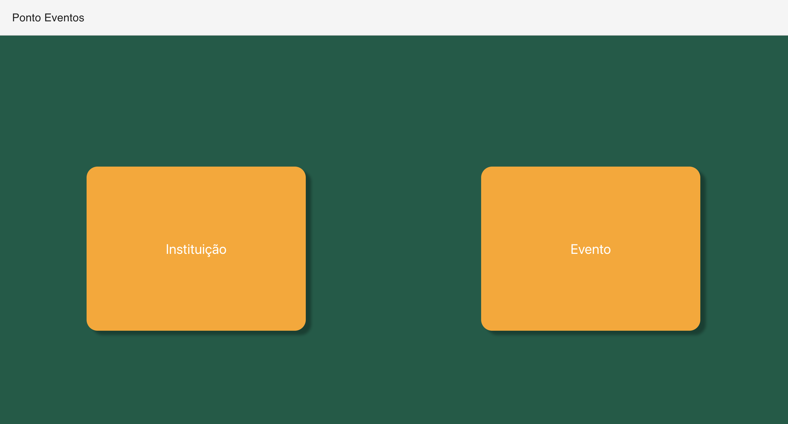
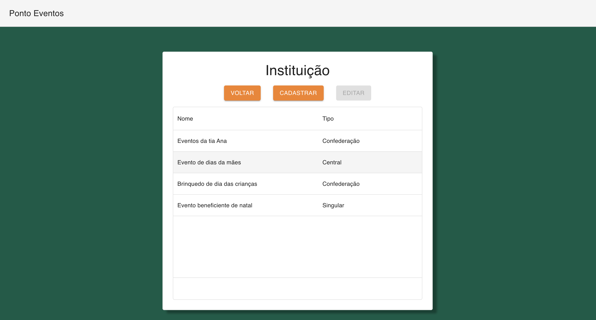
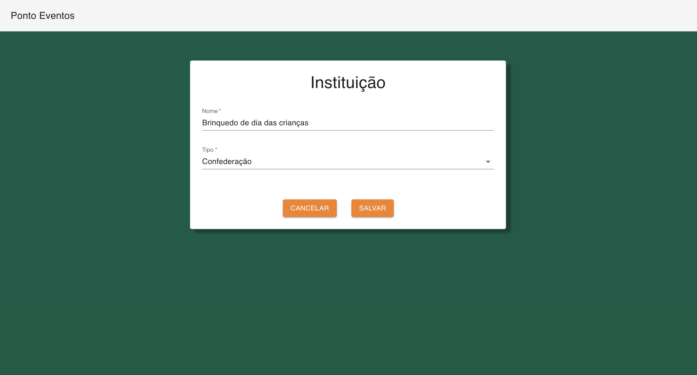

# PontoEventos
Ponto Eventos é sua plataforma de cadastro de eventos

**O sistema possui:**
- *Cadastro instituição*: Contém nome e tipo;
- *Cadastro evento*: Contém data de ínicio e data de final. A situação do evento (ativo/inativo) é alterada de acordo com a data de vigência, e é necessário selecionar uma instituição organizadora do evento.

 
## Como usar 
- ``` git clone <link/ssh_do_projeto> ```
- ``` cd PontoEventos/ ```
- Criar um banco de dados Postgresql chamado pontoeventos

**Projeto backend**
- ``` cd backend/ponto-eventos ```
- ``` mvn clean compile install ```
- ``` mvn quarkus:dev -DURL_POSTGRES={link_do_postgres_local} ```

* **link_do_postgres_local**: por default está cadastrado *jdbc:postgresql://localhost:5432/pontoeventos*, caso a porta do banco seja 5432 pode executar apenas *mvn quarkus:dev*, caso a porta ou a URL seja diferente, é necessário passar por parametro a nova porta, ex: *mvn quarkus:dev -DURL_POSTGRES=jdbc:postgresql://localhost:5432/pontoeventos*

Com essas configurações o frontend estará rodando
**Projeto frontend**
- ``` cd frontend/ponto-eventos ```
- ``` npm install ```
- ``` npm start ```
Com essas configurações o frontend estará rodando

Agora só usar a aplicação 😁

---

### Documentação Backend

**Descrição das funcionalidades:**
O backend contém dois CRUD's completos, um para evento e outro para instituição. Os dois contém métodos de findAll(GET), findById(GET), create(POST), update(PUT) e delete(DELETE)

**Tecnologias utilizadas:**
* [Quarkus](https://quarkus.io/): Framerwork Java;
* [PostgreSQL](https://www.postgresql.org/): Banco de dados;
* [Flyway](https://pt.quarkus.io/guides/flyway): Ferramenta de migração de banco de dados em ambientes JVM;
* [Schedule](https://quarkus.io/guides/scheduler): Dependência que possibilita executar tarefas específicas periodicamente, utilizada nessa aplicação para atualizar os eventos todos os dias a meia noite, assim, caso inicie/finalize uma data de vigência, o evento é ativo/inativado;

**Utilizei uma arquitetura para separação das classes da seguinte maneira:**
1. *Service*: Contém a lógica da aplicação;
2. *Model*: Representa as tabelas do banco de dados,  e cada instância desse objeto representa uma linha da tabela, é uma entidade JPA;
3. *Controller*: Recebe solicitações do usuário, nele ficam os GET, PUT, POST e DELETE;
4. *Repository*: Para nao criar métodos para operações de CRUD, podemos usar o Repository, herdando um Model dentro dele;
5. *Converter*: Converte um Model em DTO e vice versa;
6. *DTO*: Para não devolver as entidades JPA na requisição, usamos um DTO como boa prática para não enviar dados sensível ou confidenciais;
7. *Scheduler*: Contém os arquivos de execução periódicas;
8. *Utils*: Contém os arquivos de exceção tratados, assim, cada vez que o usuário realiza uma operação inalcançável é apresentado um erro tratado;

**Ativação de eventos:**
Uma vez que a data de vigência é alcançada, para a execução das tarefas periodicamente, foi usado uma extensão do quarkus chamada quarkus-scheduler, a qual possibilita a configuração de um horário para executar tarefas periodicamento, nesse caso configurei para meia noite, assim, ao iniciar uma nova data já é feita a validação de quais eventos precisam ser ativados e quais necessitam ser inativados.

** Caso queria realizar alguns testes, é possivel alterar a data, acessando os arquivos *src/main/java/br/com/pontoeventos/scheduler/EventoScheduler* e alterar na linha 15**

Ex: 

```java
@Scheduled(cron = "0 15 10 * * ?")
```
Esse exemplo define que o método vai ser executado as 10:15 todo dia, é possivel trocar o segundo parâmetro (15) para os minutos pretendidos e o terceiro parâmetro (10) para a hora pretendida.

**O frontend não permite enviar campos em branco ou com valores não correspondentes e datas inválidas, com data de inicial maior que data final, por exemplo, caso queira fazer alguns testes com relação a isso, existe um postman para testar validações que o frontend não possibita, pois existem essas validações no backend**

---

### Documentação Frontend

**Descrição das funcionalidades:**
Ao acessar o projeto frontend é apresentado uma tela com dois botões, um para cadastrar evento e outra para cadastrar instituição;



Ao acessar um dos cadastros, ou seja, clicar em um dos botões da tela inicial, é redirecionado para uma tela de listagem, apresentando os eventos que já foram cadastrados, com a possibilidade de editar esses, ou cadastrar um novo;



A tela de editar e cadastrar são identicas, a diferença que ao acessar a tela para cadastrar um novo, os campos são apresentados em branco, e caso a tela seja para editar, os campos são preenchidos com os dados já salvos;



**Tecnologias utilizadas:**
* [React](https://react.dev/): Framework Javascript/Typescript;
* [Mui](https://mui.com/): Biblioteca de componentes, com interfaces prontas, como Text Field, Data Grid, Grid, Select, Auto Complete dentre outros;
* [Axios](https://axios-http.com/ptbr/docs/intro): Biblioteca para integração com backend;
* [Formik](https://formik.org/): Biblioteca para validação de informações dos campos;
* [Yup](https://www.npmjs.com/package/yup): Biblioteca para validação de campos obrigátorios;
* [Moment](https://momentjs.com/): Biblioteca para manipulação do formato de datas;
* [React Router Dom](https://reactrouter.com/en/main): Biblioteca para manipulação de rotas;
* [Sweet Alert](https://sweetalert2.github.io/): Biblioteca para pop'us de sucesso, erro e aviso;

**Utilizei uma arquitetura para separação das classes da seguinte maneira:**
1. *Components*: Contém os componentes da aplicação, que são utilizadas em lugares diferentes, podem ser estilizados no componente apenas uma vez;
2. *Enum*: Enumeration da aplicação, coleção de valores fixos predefinidos e eimutáveis;
3. *Model*: Models da aplicação, cada classe possui as entidades do objeto;
4. *Resource*: Classes que fazem a conexão com a API;
5. *View*: Telas do sistema


